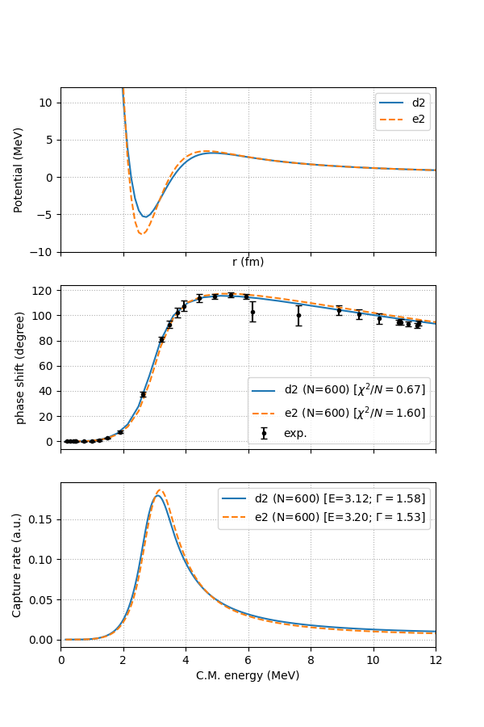

# aapot

The Python script [aapot.py](aapot.py) implements a finite-element scheme 
solution to the time-independent, one-dimensional Schrodinger equation for
a central potential.
Following the approach described in the [scattering primer](docs/scattering_primer.pdf), 
we place the two-body system in a large box and compute the scattering phase shifts. 
While the present implementation specifically considers the scattering of two 
alpha particles, it applies equaly well to the scattering of any pair of spinless
particles. In addition to computing the alpha-alpha phase shift, the script 
also computes the capture rate to a Gaussian final state.

Running the script should produce the below figure.

